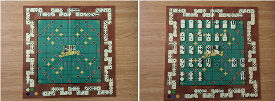

# Double Double Domino Computer Vision Challenge
The goal of this project is to develop an automatic system for scoring a specific variant of dominoes game called Double Double Dominoes. The purpose is to correctly detect pieces on the board and calculate the score of both players, given their pieces on the board. This [video](https://www.youtube.com/watch?v=ORPJIjFkluQ&t) explains the game perfectly.

## Overview of Game
### Dominoes
Dominoes is a family of tile-based games played with gaming pieces. Each domino is a
rectangular tile, usually with a line dividing its face into two square ends. Each end is
marked with a number of dots (usually for 1 to 6) or is blank.

### Double Double Dominoes
Double Double Dominoes (DDD) is a specific variant of dominoes game that combines
ideas from the game of a Scrabble into a dominoes game (Figure 1). The object of the game
is to score points by building chains of dominoes that cover the diamonds on the board.
The farther you get from the center, the bigger the score is. The score can be increased by using double dominoes (domino tiles with the same value at both ends, such as 0-0, 1-1,
etc) or taking advantage of the position of the score piece placed on the track score.

Figure 1: The DDD board (left) and all possible domino tiles placed on the board (right).

### Board
The DDD playing board (Figure 1) is divided into a 15 × 15 grid of squares and the score
track that occupies the outside border of the game board. The board is marked with
squares containing numbered colored diamonds:
• 16 blue diamonds for 1 point;
• 16 yellow diamonds for 2 points;
• 16 brown diamonds for 3 points;
• 16 black diamonds for 4 points;
• 4 green diamonds for 5 points.

### The play
The first player must place the domino on the star ★ square at the center of the board. Every other domino must be placed so that one end touches exactly one domino with the
matching number. The other end either touches nothing or bridges the gap by matching
another domino. When a player plays a double domino, the player may choose to immediately place another domino onto the board but it must be placed next to that double
domino. The player turn ends when he chooses not to place any additional dominoes, or
the player places a domino that is not double domino.

## Setup
### Requirements
I used Python 3.9 for this notebook. I also use OpenCV Contrib (as opposed to normal OpenCV). Requirements can be found in `requirements.txt`.

### How to run the Notebook
Notebook: DoubleDoubleDominoDetectorNB.ipynb
The notebook has to be placed alongside the "features/" directory and "template.jpg" into the root of the project.

Cell: After installing dependencies, open notebook with the appropriate environment, and look the first code cell containing train_path. Change the (relative) path to the one containing test data.
So e.g. if train_path is "train/regular_tasks/", train_path will now be "test/regular_tasks/"

Output: the output directory is "results/", and there is a text file associated with each image in the train/test set.

## Further Details
For further details on the what the project entails, read `ProjectDetails.pdf`. If you'd like a better understanding of my approach, read `ProjectApproach.pdf`.

### Results
I obtained 493/500 predictions correctly, only missing out a few positions/scores in the last game. On the test set, the error was much closer to 400/500.

